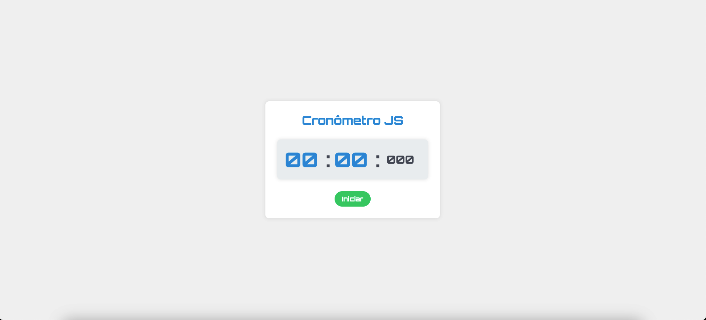
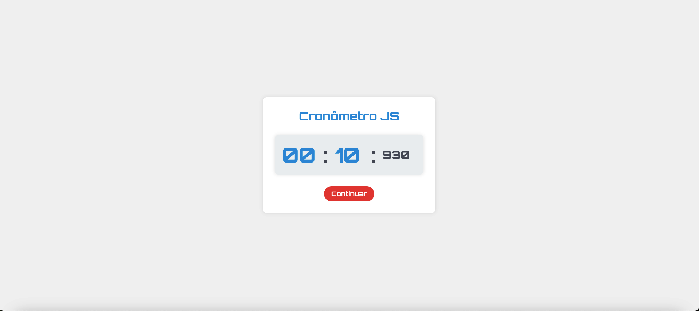
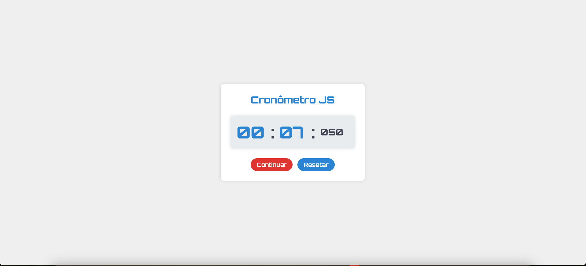

# ⏱️ Cronômetro JS

Um simples cronômetro desenvolvido em HTML, CSS e JavaScript.


## 🚀 Recursos

- **Iniciar, Pausar, Continuar e Resetar:** Controle total sobre o cronômetro.
- **Visual Atraente:** Estilo moderno e atraente.
- **Fácil de Usar:** Interface intuitiva e amigável.

## 🛠️ Ferramentas Utilizadas

- **HTML**
- **CSS**
- **JavaScript**

## 📷 Demonstração

<details>
    <summary>Clique aqui para expandir</summary>
    
    
    
</details>

## 📖 Como Usar

1. Clone este repositório:

   ```bash
   git clone https://github.com/seu-usuario/nome-do-repositorio.git
